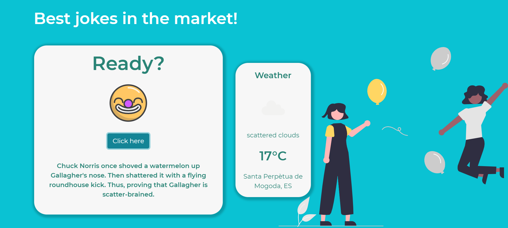

# joke-app
Create a random joke generator with HTML, CSS, JS and API Rest.

## Requirements
You will need to have a code editor installed in your PC.
Open your terminal and clone this project:
`git clone https://github.com/ain12/joke-app.git`
After this execution, you will get a copy of this project.

### Important 
The API Key function is in `apiKey.js`. You will see that `API_KEY` is defined as a default. If you leave it like this, the function `getWeatherInfo()` will show an alert with an error. The reason behind this is because of security issues. In order to get the weather, change `"API_KEY"`with your own API Key from https://openweathermap.org/:

```
export function getApiKey() {
    return "<API_KEY>";
}
```
In order to maintain your API Key secure, add the `apiKey.js` inside a `.gitignore` file before pushing your commits to GitHub or similar. 

## Tools
- HTML5
- CSS3
- BOOTSTRAP 4.6.0
- APIs from: https://api.chucknorris.io/, https://icanhazdadjoke.com/ and https://openweathermap.org/.
- POSTMAN

## Demo


Website: https://ain12.github.io/joke-app/